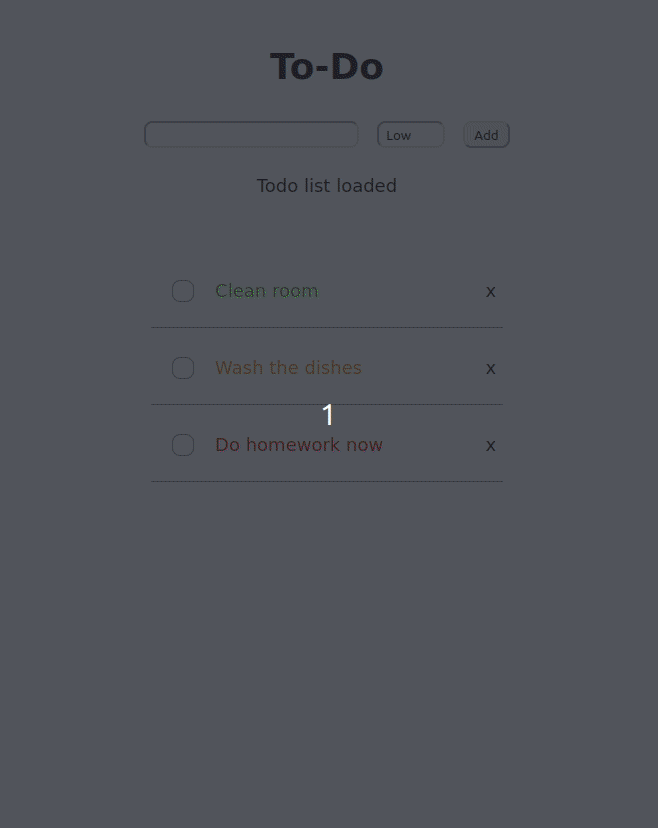

# React To-Do App

Simple to-do app to practice using react and thinking within react

## Concepts Practiced

### Handling events

- onChange with the input in order to set the state to prepare for adding items
- onClick for the add button as well as the delete span elements to delete items
- onSubmit with preventDefault() to handle submitting the input form with the enter button

### Lists and Keys

- Created lists dynamically and assigned keys based on iterated IDs

### Lifting state up

- Using props to remove items from the list

## What I've learned

- Sometimes it is not necessary to have additional components as containers. In this case the ListComponent was a useless middle ground for the list items.

- Using index for keys results in strange state behavior with the diff algorithm. This happens specifically with the checkboxes created from dynamically.

- If events handle twice, a potential issue is caused by the e.preventDefault in a helper function causing render to call twice.

- componentDidMount happens on re-renders and componentDidUpdate was unnecessary to update the disappearing log the way I did
